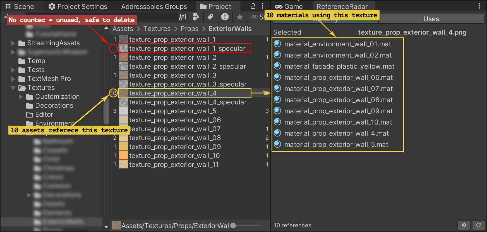
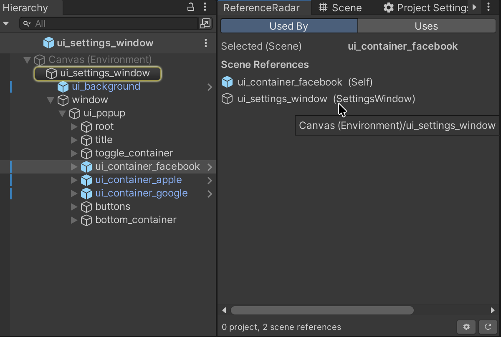
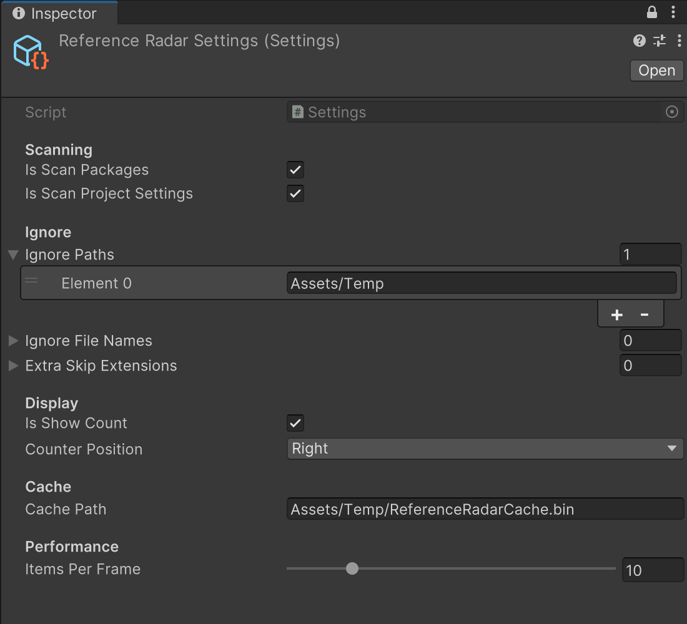

# ReferenceRadar



**Lightweight Unity Editor tool for tracking asset references.**

Select any asset or scene object and instantly see what references it and what it references. No manual searching, no guesswork.

---

## Table of Contents

- [Features](#features)
- [Installation](#installation)
- [Usage](#usage)
- [Settings](#settings)
- [Cache](#cache)
- [How It Works](#how-it-works)

---

## Features

### Two-Way Reference Tracking

Switch between **Used By** and **Uses** modes with a single click. The Project window shows reference count overlays next to each asset - select any asset to instantly see all references in the ReferenceRadar panel on the right.

- **Used By** - find every asset that references the selected one. *"What will break if I delete this?"*
- **Uses** - find every asset the selected one depends on. *"What does this prefab actually need?"*

Results are sorted alphabetically. Click any row to ping and highlight the asset in the Project window.

### Scene Object Support



Works with scene objects too, not just project assets. Select any GameObject in the Hierarchy and see which other objects reference it and which assets it depends on. Results are split into **Scene References** and **Asset References**. Scene references update automatically on hierarchy changes, scene open/close, and undo/redo.

### Settings



All configuration lives in a single ScriptableObject. To open it, click the **gear icon** in the bottom-right corner of the ReferenceRadar window - it will open or auto-create the Settings asset at `Assets/ReferenceRadarSettings.asset`.

The reference count overlay position is configurable - it can be displayed on the left or right side of each asset row in the Project window, or turned off entirely.

### Other Highlights

- **Multi-selection** - select multiple assets, results are merged with duplicates removed
- **Virtualized scroll** - large result lists render smoothly, only visible rows drawn per frame
- **Prefab Stage aware** - queries scope to prefab contents when editing in isolation
- **Incremental cache** - every import, move, or deletion triggers a targeted background update, no manual rescanning needed

---

## Installation

### Via Package Manager

1. Open **Window > Package Manager**
2. Click **+** -> **Add package from git URL...**
3. Paste:

```
https://github.com/BroEngine/reference-radar.git
```

### Via manifest.json

Add to `Packages/manifest.json`:

```json
{
  "dependencies": {
    "com.bro.reference-radar": "https://github.com/BroEngine/reference-radar.git"
  }
}
```

### Manual

Clone or download the repo and copy the `Editor/` folder anywhere inside your project's `Assets/` folder.

---

## Usage

1. Open the window: **Window > ReferenceRadar**
2. Click **Scan Project** - runs once, builds the cache
3. Select any asset in the Project window or any GameObject in the Hierarchy
4. Results appear instantly

The toolbar switches between **Used By** and **Uses** modes. The footer shows the total reference count and two buttons - **Settings** and **Refresh** (full rescan).

### Scene Objects

Select a GameObject in the Hierarchy. The window switches to scene mode automatically:

- **Used By** - other GameObjects with serialized references to this object
- **Uses** splits into Scene References and Asset References

> The first entry in Scene References is always **Self**.

---

## Settings

| Field | Default | Description |
|---|---|---|
| Scan Packages | `true` | Include the `Packages/` folder |
| Scan Project Settings | `true` | Include the `ProjectSettings/` folder |
| Ignore Paths | - | Path prefixes to skip entirely (e.g. `Assets/Plugins/SomeSDK/`) |
| Ignore File Names | - | File names without extension to skip |
| Extra Skip Extensions | - | Additional extensions to treat as non-scannable (e.g. `.bank`) |
| Show Count | `true` | Toggle the reference count overlay in the Project window |
| Counter Position | `Right` | `Left` or `Right` |
| Cache Path | `Library/ReferenceRadarCache.bin` | Path relative to project root |
| Items Per Frame | `10` | Assets processed per editor frame during incremental updates. Range: 1-50 |

---

## Cache

The cache is stored by default at `Library/ReferenceRadarCache.bin` and persists across editor sessions. The `Library/` folder is already ignored by version control in Unity projects, so the cache is never committed to the repo.

If needed, the path can be changed in Settings - for example to move it into `Assets/` and put it under VCS, or to share it across a team. In that case just add the custom path to `.gitignore` if you don't want it tracked.

The cache uses a binary format with packed 16-byte GUIDs instead of text, so the file stays very small even on large projects - typically a few hundred kilobytes.

---

## How It Works

1. **Full Scan** - iterates all asset paths, classifies each file (YAML / Binary / Folder / NonReadable), extracts GUID references, stores results in binary cache
2. **UsedBy Map** - builds a reverse lookup after scanning: for each asset, which others reference it
3. **Incremental Updates** - `AssetPostprocessor` detects imports, moves, and deletions, queuing only affected GUIDs for background re-scan
4. **Binary Cache** - compact format with packed 16-byte GUIDs, magic number validation, and version header; typically 5-10x smaller and faster to load than JSON
